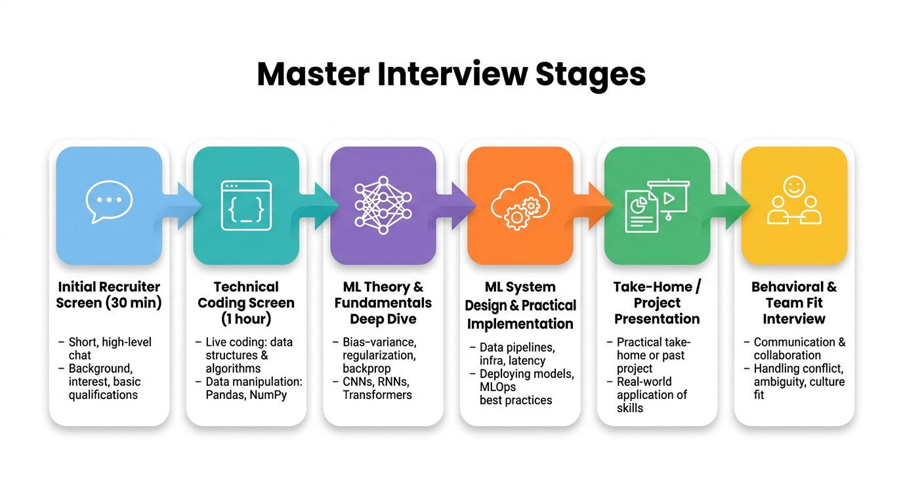

# AI Engineering

Resources for the AI Engineering career path, including interview preparation, project guidelines, and daily habits.

## Contents

- [path-ai-engineering.md](path-ai-engineering.md) - Comprehensive roadmap of AI Engineering fundamentals, frameworks, and tools (LLMs, RAG, Agents, MLOps, Vector DBs)
- [project-guidelines.md](project-guidelines.md) - Template for structuring AI/ML projects covering problem definition, data, modeling, deployment, and monitoring
- [github-tips](github-tips) - Tips for maintaining consistent GitHub contributions and building a strong profile
- [Prompt Engineering PDF](22365_3_Prompt%20Engineering_v7%20(1).pdf) - Prompt engineering reference material

## Infographics

### Master Interview Stages

Overview of the typical AI/ML engineering interview pipeline: Initial Recruiter Screen, Technical Coding Screen, ML Theory & Fundamentals Deep Dive, ML System Design & Practical Implementation, Take-Home / Project Presentation, and Behavioral & Team Fit Interview.

