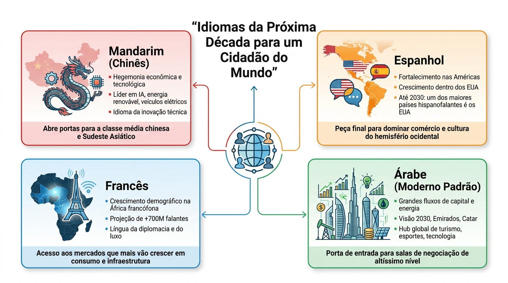

## Youtube Channels

- [Accent's Way English with Hadar](https://www.youtube.com/@hadar.shemesh)
- [ENGLISH with James · engVid](https://www.youtube.com/@engvidJames/videos)
- [RealLife English](https://www.youtube.com/c/RealLifeEnglish1/featured)
- [Learn English With TV Series](https://www.youtube.com/c/LearnEnglishWithTVSeries/featured)
- [**English Like A Native**](https://www.youtube.com/@EnglishLikeANative/videos)

## **1. Mandarim (Chinês)**

**O idioma da hegemonia econômica e tecnológica.**

**Por que na próxima década?** A China não é mais apenas a "fábrica do mundo", mas a líder em Inteligência Artificial, energia renovável e veículos elétricos. Na próxima década, o mandarim será o idioma da inovação técnica tanto quanto o inglês.

**Impacto de "Cidadão do Mundo":** Abre as portas para a maior classe média consumidora do planeta e para parcerias em todo o Sudeste Asiático (onde a influência chinesa é total).

## **2. Espanhol**

**A consolidação das Américas e o crescimento nos EUA.**

**Por que na próxima década?** O espanhol está deixando de ser uma língua "regional" para se tornar uma língua de poder dentro dos Estados Unidos. Até 2030, os EUA serão um dos maiores países de língua espanhola do mundo.

**Impacto de "Cidadão do Mundo":** Para quem vive no Brasil, é a peça final para dominar o comércio e a cultura de todo o hemisfério ocidental. É o idioma com o melhor "custo-benefício" de aprendizado para você.

## **3. Francês**

**A língua do futuro demográfico (África).**

**Por que na próxima década?** Enquanto a Europa envelhece, a África francófona (países como República Democrática do Congo, Senegal e Costa do Marfim) vive uma explosão demográfica e econômica. Estima-se que, em algumas décadas, o francês terá mais de 700 milhões de falantes, a maioria na África.

**Impacto de "Cidadão do Mundo":** Além de ser a língua da diplomacia e do luxo europeu, o francês te posiciona nos mercados que mais crescerão em consumo e infraestrutura nos próximos anos.

## **4. Árabe (Moderno Padrão)**

**O idioma dos grandes fluxos de capital e energia.**

**Por que na próxima década?** Com a transição energética e os fundos soberanos gigantescos da Arábia Saudita (Projeto Vision 2030), Emirados Árabes e Catar, o Oriente Médio está se tornando um hub global de turismo, eventos esportivos e tecnologia.

**Impacto de "Cidadão do Mundo":** Dá acesso a uma região que detém uma fatia massiva da riqueza líquida global. É um diferencial raro que te coloca em salas de negociação de altíssimo nível.

## Alcance Global
| Idioma | Falantes Totais | Papel Estratégico |
| --- | --- | --- |
| **Inglês** | ~1,5 bilhão | Negócios, Ciência e Tecnologia. |
| **Mandarim** | ~1,1 bilhão | Poder Econômico, IA e Manufatura Global. |
| **Espanhol** | ~560 milhões | Cultura, Consumo e Expansão nos EUA. |
| **Português** | ~260 milhões | Commodities, Energia e Hub na África. |
| **TOTAL** | **~3,4 Bilhões** | **Domínio do Ocidente + Maior Potência Asiática.** |

