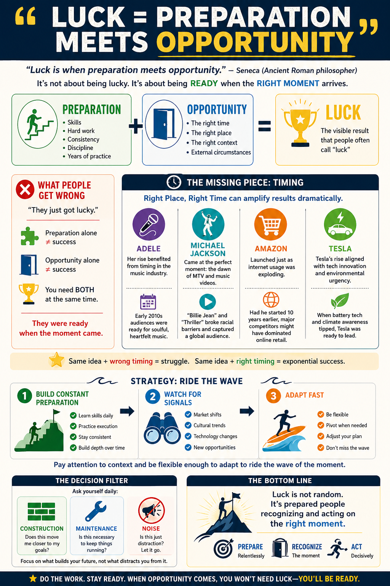
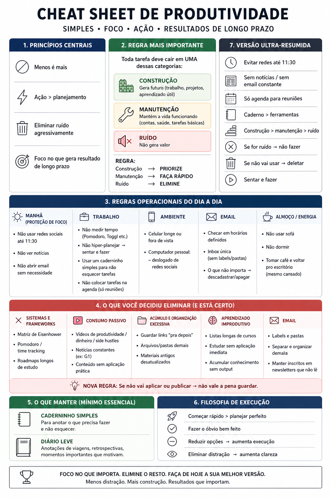
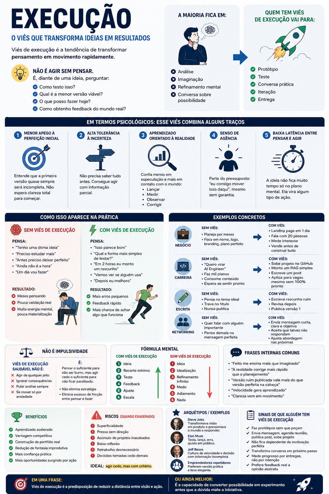

## Youtube Channels

- [Dr. Shadé Zahrai](https://www.youtube.com/@Dr.ShadeZahrai/videos)
- [Firm Learning](https://www.youtube.com/@FirmLearning/videos)
- [Better Ideas](https://www.youtube.com/c/BetterIdeas/featured)

## Infographics

### Luck = Preparation Meets Opportunity

Based on Seneca's quote, this infographic illustrates how luck is not random — it's the result of being ready when the right moment arrives. It breaks down the formula (Preparation + Opportunity = Luck), gives real-world examples like Adele, Michael Jackson, Amazon, and Tesla, and offers strategies to "ride the wave" by building constant preparation, watching for signals, and adapting fast.

### Cheat Sheet de Produtividade

A Portuguese productivity cheat sheet focused on simplicity, focus, action, and long-term results. Covers core principles (less is more, action > planning), the most important rule (construction > maintenance > noise), daily operational rules, what to eliminate, what to maintain, and an execution philosophy.

### Viés de Execução

An infographic (in Portuguese) about the execution bias — the tendency to transform thought into action rapidly. It explains how this bias combines psychological traits like low attachment to perfection, high tolerance for uncertainty, agency, and low latency between thinking and acting. Includes practical examples, mental formulas, benefits, and risks when taken to extremes.

